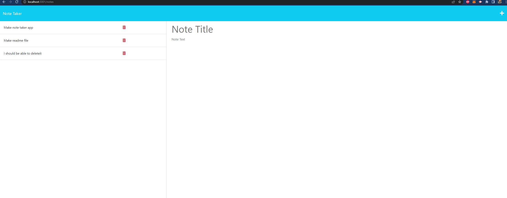

# note-taker

## Purpose
I wanted to make a note taking app to keep up with tasks that i needed to be done. I also needed it to keep track of certain information I might find useful in the future.

## Links
- Github: https://github.com/waustin45
- Repository: https://github.com/waustin45/note-taker.git
- Live Site: https://note-taker-wah.herokuapp.com/notes

## User Story 
````
As a user I want to take notes to keep track of tasks
When I go to create a note I want to save it
Then I want to view my saved notes
When I view one of my saved notes it should populate in the main section
If I am done with a note
Then I should be able to delete that note
````

## First Look 



 
